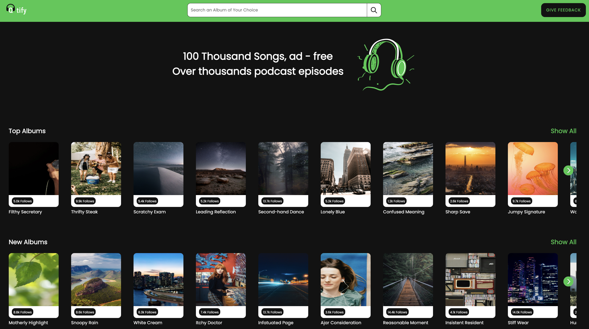

<h1 align="center">🎧 Qtify – A Spotify-Inspired Music Streaming Experience</h1>

Qtify is a modern web application that delivers a Spotify-like experience right in your browser. It allows users to discover music, manage playlists, and enjoy seamless playback through a clean and responsive user interface. Whether you're curating your favorites or just vibing with trending tracks, Qtify has you covered.

---

## 🌐 Live Demo


🟣 **Vercel**  
https://lsquare.vercel.app/

---

## ✨ Features

- 🔐 **Authentication System**  
  Log in securely to access personalized playlists and settings.

- 🎶 **Music Library**  
  Browse an extensive collection of songs, albums, and artists.

- 🔍 **Smart Search**  
  Instantly search for music by name, genre, or artist.

- 📂 **Playlist Management**  
  Create, update, and manage custom playlists with ease.

- ⏯️ **Music Player**  
  Control playback with intuitive play/pause, skip, and volume features.

- 📱 **Responsive Design**  
  Optimized for mobile, tablet, and desktop for a smooth experience everywhere.

---

## 🖼️ Screenshot

### 🏠 Home Page



---

## 🧰 Getting Started

Set up the Qtify project on your local development environment using the guide below.

### ✅ Prerequisites

- **Node.js** (v14+ recommended)  
  [Download Node.js](https://nodejs.org/)

- **Spotify Developer Account**  
  Create one at [Spotify for Developers](https://developer.spotify.com/dashboard/)

---

### 📦 Installation

1. **Clone the repository:**

   ```bash
   git clone https://github.com/notvedant24/qtify
Navigate to the project directory:

bash
Copy
Edit
cd L-Square-QTify
Install dependencies:

bash
Copy
Edit
npm install
⚙️ Environment Configuration
Create a .env file in the project root.

Add the following environment variables:

env
Copy
Edit
REACT_APP_SPOTIFY_API_KEY=your_spotify_api_key
REACT_APP_BASE_API_URL=https://api.spotify.com/v1
REACT_APP_REDIRECT_URI=http://localhost:3000/callback
🔑 Replace your_spotify_api_key with the key from your Spotify Developer Dashboard.

🚀 Running the App
Start the development server:

bash
Copy
Edit
npm start
Then open your browser and visit:

arduino
Copy
Edit
http://localhost:3000
You’re now running Qtify locally!

🤝 Contributing
We welcome contributions! Whether it's a bug fix, new feature, or improvement suggestion, feel free to fork the repo and open a pull request.

Check out our CONTRIBUTING.md for contribution guidelines.

🧠 Additional Notes
Make sure your Spotify Developer app has the correct redirect URI set:
http://localhost:3000/callback

For deployment, platforms like Netlify and Vercel work flawlessly with React apps.

👨‍💻 Developed By
Vedant Singh
🔗 GitHub Profile

yaml
Copy
Edit

---

✅ Ready to copy and paste into your `README.md` file.  
Let me know if you want a downloadable version, deploy badges, or screenshot embedding help.
